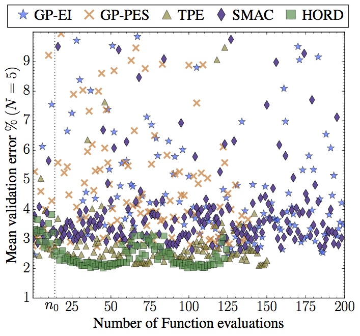

# Efficient Hyperparameter Optimization of Deep Learning Algorithms Using Deterministic RBF Surrogates

Code for reproducing results published in the paper "Efficient Hyperparameter Optimization of Deep Learning Algorithms Using Deterministic RBF Surrogates" (AAAI-17) by Ilija Ilievski, Taimoor Akhtar, Jiashi Feng, and Christine Annette Shoemaker. 

### About

The paper presents an algorithm for Hyperparameter Optimization via RBF and Dynamic coordinate search (HORD).
HORD searches a surrogate model of the expensive function (full training and validation of deep learning algorithm) for the most promising hyperparameter values through dynamic coordinate search and thus requires many fewer expensive function evaluations. 
HORD does well in low dimensions but it is exceptionally better in higher dimensions.
 Extensive evaluations on MNIST and CIFAR-10 for four deep learning algorithms demonstrate HORD significantly outperforms the well-established Bayesian optimization methods such as GP, SMAC, and TPE. 
For instance, on average, HORD is more than 6 times faster than GP-EI in obtaining the best configuration of 19 hyperparameters.




For more details download the paper from [arxiv](https://arxiv.org/abs/1607.08316).

### Installation

The HORD algorithm presented in the paper uses the open-source pySOT toolbox by David Eriksson, David Bindel, and Christine Shoemaker.
To install pySOT go to [pySOT](https://github.com/dme65/pySOT) and follow the directions there.

The implementation of the deep learning algorithms is in torch, so you would also need to install torch from [torch](https://github.com/torch/distro). We ran the deep learning algorithms on a cluster of GPU devices but you can modify the code and run them on CPU.


### Reproducing

After successfully installing pySOT and torch you can run the experiments by executing:

```
cd 6-MLP
python pySOT_runner.py 1 200 139 exp-1
```

6-MLP is the folder containing the code for experiment 6-MLP (as referenced in the paper). Other experiments are 8-CNN, 15-CNN, or 19-CNN.

The four arguments to `pySOT_runner.py` are the following:

- number of threads: we only tested the serial version of pySOT i.e. only one thread in all our experiments
- function evaluation budget: we limit the number of function evaluations (full training and validation of the deep learning algorithms) to 200 in all our experiments.
- seed number
- experiment name


### Citing the HORD algorithm

To cite the paper use the following BibTeX entry:

```
@inproceedings{melville2002content,
  title={Efficient Hyperparameter Optimization of Deep Learning Algorithms Using Deterministic RBF Surrogates},
  author={Ilievski, Ilija and Akhtar, Taimoor and Feng, Jiashi and Shoemaker, Christine},
  booktitle={31st AAAI Conference on Artificial Intelligence (AAAI-17)},
  year={2017}
}
```


